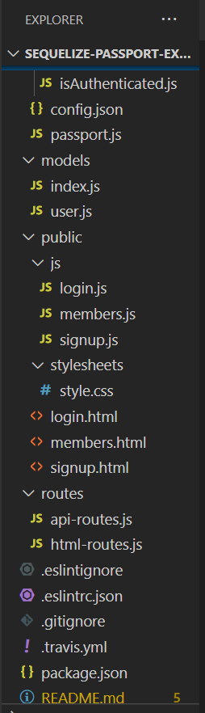

# Reverse Engineering Authentication

Reverse engineer the starter code provided and create a tutorial for the code.

In the Develop folder, there is starter code for a project. 
Begin inspecting the code to get an understanding of each file's responsibility. 
Then, in a Google Doc, write a tutorial explaining every file and its purpose. 
If one file is dependant on other files, be sure to let the user know.

At the end of the tutorial, add instructions for how you could now add changes to this project.

Following the common templates for user stories, we can frame this challenge as follows:

AS A developer

I WANT a walk-through of the codebase

SO THAT I can use it as a starting point for a new project

# Minimum Requirements

- A link to a document or video with instructions on how what each section of code is doing in Develop/.

# Submission on BCS

- You are required to submit the following:

